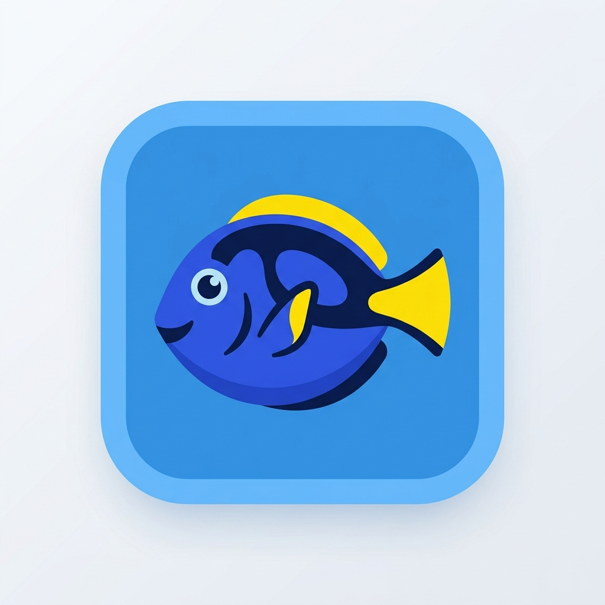

<p align="center">
  
</p>

<h1 align="center">Dory</h1>

<p align="center">
  <strong>A premium, standalone file chooser portal backend and file manager</strong>
</p>

<p align="center">
  <a href="https://github.com/Twilight0/dory/actions/workflows/build.yml">
    
  </a>
  
  
</p>

---
s

## Overview

**Dory** is a specialized fork of the Nemo file manager, specifically tailored to serve as a high-fidelity, native **D-Bus File Chooser Portal helper**.

Unlike standard file managers, **Dory** is fully decoupled and optimized to run alongside your favorite desktop components (even standard Nemo) with a **Zero Conflict Footprint**. It enables rich, native folder and file selection dialogs for flatpaks, sandboxed apps, and any desktop clients utilizing the `xdg-desktop-portal-xapp-filepicker` backend.

---

## Features & Enhancements

Dory preserves the power of the Nemo engine while introducing modern custom features for portal dialog orchestration:

### Standalone & Zero Conflict
*   **Complete Namespacing**: Every binary, desktop file, D-Bus service, namespace, library, and GSettings schema has been renamed from `nemo` to `dory`.
*   **Side-by-Side Coexistence**: Can be installed concurrently with official Nemo packages without overlapping files, config schemas, or D-Bus activations.

### Polished Desktop & Portal Integration
*   **Premium Branding**: Features custom Blue Tang fish application icons and matching visual tokens.
*   **Dual View support**: Seamlessly renders sidebars, compact view grids, and list views inside the portal dialogue frame.
*   **Slider-based Image Previews**: Real-time thumbnail scaling/zooming is fully supported inside the dialog.
*   **Video Thumbnail Support**: Generates thumbnails for video files up to 100MB using ffmpegthumbnailer.

### Custom Portal Overrides
*   **Localized "Save" Override**: Automatically changes the action button label to localized `_Save` using gettext translations when invoked in save dialog mode.
*   **Intelligent Overwrite Modal**: Intercepts save paths; if a file already exists, it displays a standard modal confirmation dialog asking the user if they wish to overwrite, keeping the picker open if they select "No".
*   **GApplication Lifecycle Daemon**: Restructured D-Bus service activation handles daemon lifespans via GApplication holds, preventing the background process from terminating while portal selections are pending.

### D-Bus File Chooser Interface (`org.Dory.FileChooser`)
*   **OpenFile**: Open files/folders with filters, multiselect, and initial folder support.
*   **SaveFile**: Single file save with suggested name, initial folder, and overwrite confirmation.
*   **SaveFiles**: Multi-file save for applications that export multiple files at once (e.g. GIMP layers). Takes a list of suggested filenames and returns URIs for all saved files.

### Folder Properties
*   **Disk Usage Scanner with Cancel**: The folder properties dialog shows disk usage with a Stop button to cancel long-running scans.

---

## Installation

### Arch Linux (AUR)

```bash
yay -S dory-git
```

This provides `dory`, `dory-desktop`, and all core binaries. The package declares `provides=(dory nemo)` and `conflicts=(dory nemo)` to satisfy Cinnamon's nemo dependency.

### Building from Source

#### Dependencies
*   `cinnamon-desktop`
*   `libexif`
*   `exempi`
*   `xapp`
*   `gtk3`
*   `gobject-introspection`

#### Build Command
```bash
meson setup build \
  --prefix=/usr \
  --buildtype=release \
  -Ddeprecated_warnings=false \
  -Dempty_view=false \
  -Dexif=true \
  -Dgtk_doc=false \
  -Dgtk_layer_shell=false \
  -Dselinux=false \
  -Dtracker=false \
  -Dxmp=true

meson compile -C build
sudo meson install -C build
```

---

## Running as a Portal Backend

To use Dory for file picking, pair it with the **`xdg-desktop-portal-xapp-filepicker`** backend implementation. When flatpaks or portal-compliant apps query file selection, they will automatically spawn the Dory engine under the hood.

```bash
# Install the portal backend from AUR
yay -S xdg-desktop-portal-xapp-filepicker-git
```

---

## Dory Extensions

A suite of extensions is available in the `dory-extensions` repository:

```bash
# Install all extensions at once
yay -S dory-dropbox-git dory-fileroller-git dory-image-converter-git \
       dory-share-git dory-repairer-git dory-python-git dory-preview-git \
       dory-seahorse-git dory-compare-git dory-terminal-git \
       dory-emblems-git dory-audio-tab-git dory-media-columns-git \
       dory-pastebin-git
```

See [dory-extensions](https://github.com/Twilight0/dory-extensions) for details.

---

## License

Dory is free software licensed under the **GPL-3.0-or-later** and **LGPL-2.1-or-later**.
